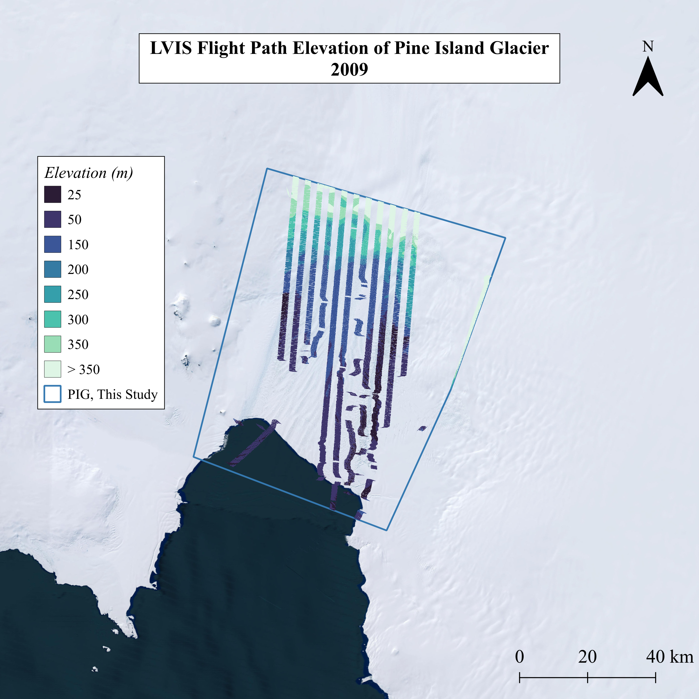
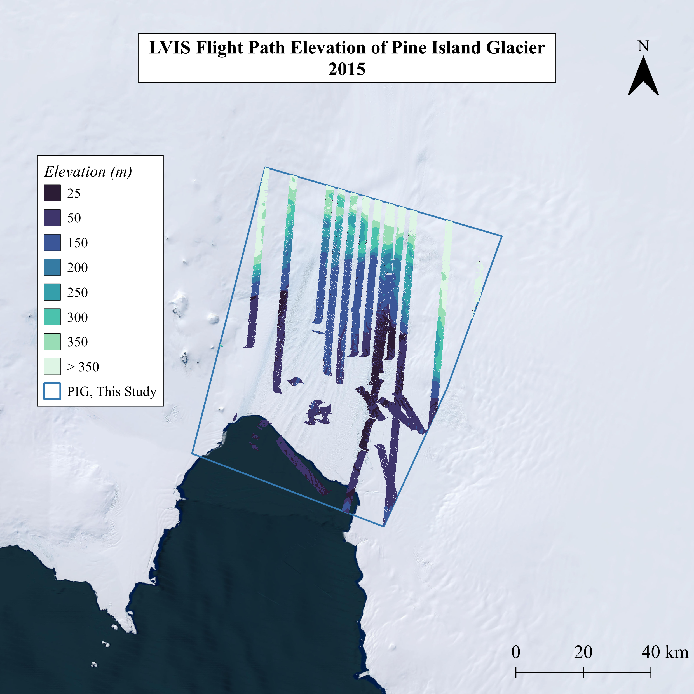
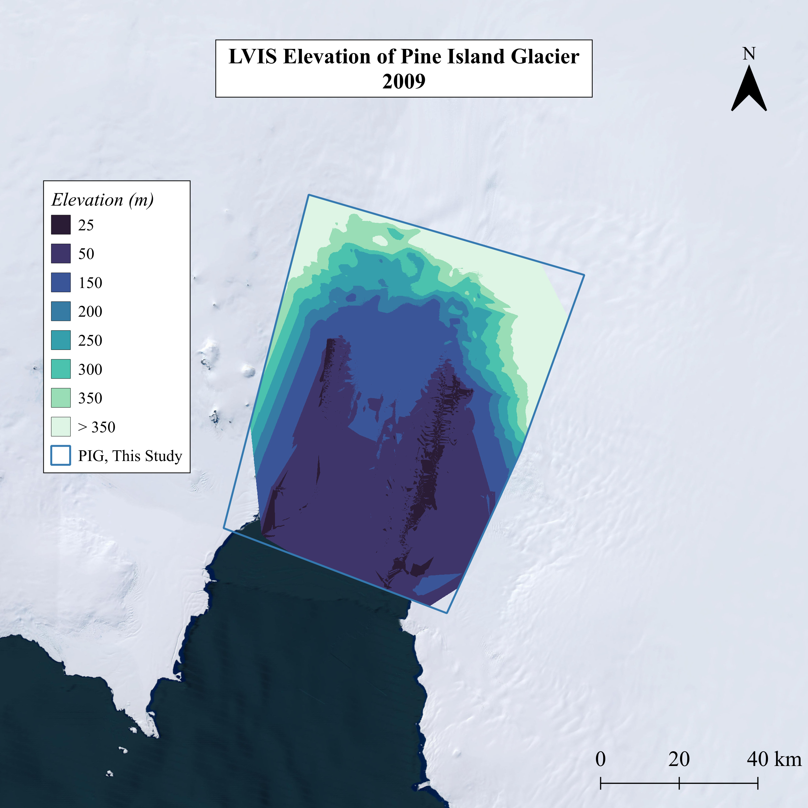
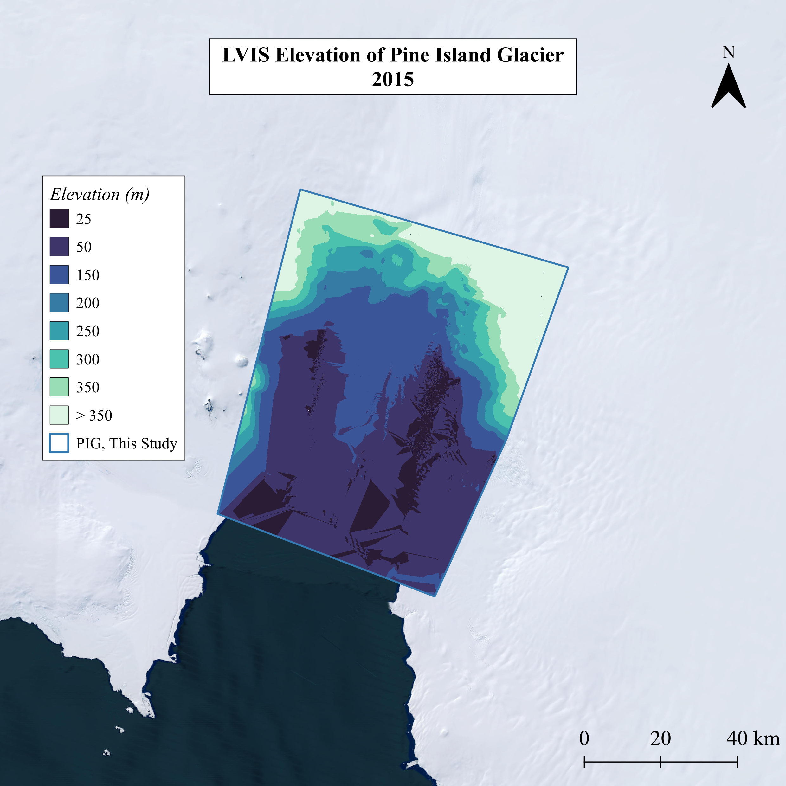
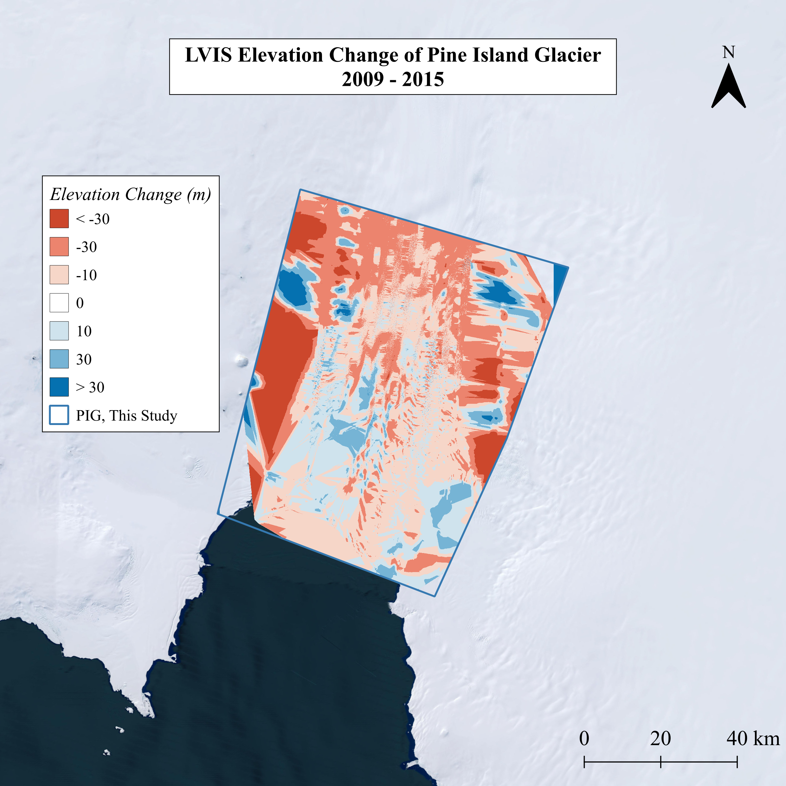
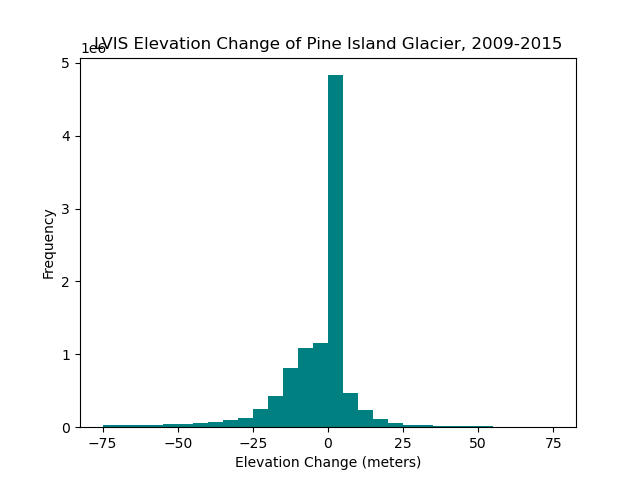

# LVIS Project

The main purpose of this project was to develop a library of python code to process NASA's LVIS LiDAR data to examine ice mass change of Pine Island Glacier from acquisition flights in 2009 and 2015.  

## Contents
- [Data](#Data)
- [Code Structure](#Code-Structure)
- [Usage Instructions](#Usage-Instructions)
- [Outputs](#Outputs)

## Data
**LVIS**:  
NASA's Land, Vegetation, and Ice Sensor [(LVIS)](https://lvis.gsfc.nasa.gov/Home/index.html) is an airborne LiDAR instrument which retrieves data on surface topography and 3-D structure. This project was designed to deal with LVIS data acquired during NASA's [Operation IceBridge](https://icebridge.gsfc.nasa.gov/), which monitored key glaciers at the poles during the gap in ICESat (2003-09) and ICESat-2 (2018-) missions. The LVIS data is available on the [NASA Earth Data Portal](https://search.earthdata.nasa.gov/search?q=LVIS) or via the [LVIS webpage](https://lvis.gsfc.nasa.gov/Data/GE.html?status=submitted).  

**PIG:**  In this study, the spatial extent of Pine Island Glacier (PIG) was defined as the marine-terminating subset of that defined by the GLIMS Glacier Database. The study area was manually assigned informed by both the GLIMS shapefile and LVIS flight paths in both 2009 and 2015. The shapefile used in this project is accessible in `shapes/pine_island_glacier.shp` alongside its supplementary files.  

  
  

## Code Structure

### Scripts
- [readLVIS.py](#readLVIS.py): *Base-class to read LVIS files and store data*.
- [processLVIS.py](#processLVIS.py): *Sub-class to process LVIS data and estimate ground*.
- [plotLVIS.py](#plotLVIS.py): *Sub-class to visualise LVIS data*.
- [methodsDEM.py](#methodsDEM.py): *Class and independent methods to handle DEM geotiff files*.
- [manageRAM.py](#manageRAM.py): *Methods to calculate CPU runtime and RAM usage*

### readLVIS.py
File contains a class to read and store LVIS data from a HDF5 file format. The class holds methods to retrieve all or a spatial subset of LVIS data from a file. The default coordinate reference system encoding for all LVIS data is WGS84 / EPSG:4326.  

*Class:* **readLVIS**  
The data is stored as the variables:

    waves:   Lidar waveforms as a 2D numpy array.
    lon:     Longitude as a 1D numpy array.
    lat:     Latitude as a 1D numpy array.
    nWaves:  Number of waveforms in this file as an integer.
    nBins:   Number of bins per waveform as an integer.
    lZN:     Elevation of the bottom waveform bin.
    lZ0:     Elevation of the top waveform bin.
    lfid:    LVIS flight ID integer.
    shotN:   LVIS shot number for this flight.

The class is initialised as follows: 

    from readLVIS import readLVIS
    LVIS = readLVIS(filename)

The data can also be read as a subset, with defined bounds, and or with elevations set:
    
    LVIS = readLVIS(filename, minX, minY, maxX, maxY)
    LVIS = readLVIS(filename, onlyBounds = True)
    LVIS = readLVIS(filename, setElev = True)

The class holds the following methods:
    
    set_elevations():  Converts the compressed elevations into arrays of elevation, z.
    one_waveform():    Returns one LVIS waveform as an array.
    dump_coords():     Returns all coordinates of data as two numpy arrays.
    dump_bounds():     Returns the bottom left and top right coordinates of data in file.

The main purpose of this class is to give the attribute of elevations to each waveform:
    
    LVIS.z

  
### processLVIS.py
File contains a class to process LVIS data, inheriting from the class **readLVIS** in *readLVIS.py*. The class initialiser is not overwritten and expects a LVIS file.  

*Class:* **processLVIS**  
The additional variables:
    
    threshold:    Value threshold outwidth is considered noise.
    zG:           Centre of gravity signal, calibrated specifically for ice.
    res:          Range resolution.
    noiseBins:    Number of bins as an integer.
    meanNoise:    Mean waveform noise.
    stdevNoise:   Standard deviation of waveform noise.
    denoised:     Smoothed, denoised waveform.

The class is initialised as follows: 

    from processLVIS import processLVIS
    LVIS = processLVIS(filename)

The class holds the following methods:
    
    estimate_ground():    Returns ground estimate from waveform.
    set_threshold():      Sets waveform noise threshold.
    centre_gravity():     Finds centre of gravity of denoised waveforms.
    find_stats():         Calculates standard deviation and mean of noise.
    denoise():            Removes noise in waveform data.

The main purpose of this class is to give the attribute of ground estimate to each waveform:
    
    LVIS.zG

### plotLVIS.py
File contains a class to visualise LVIS data, inheriting from the class **processLVIS** in *processLVIS.py*. The class initialiser is not overwritten and expects a LVIS file.  

*Class:* **plotLVIS**  
The additional variables:
    
    inProj:               Value threshold outwidth is considered noise.
    outProj:              Centre of gravity signal, calibrated specifically for ice.
    x, y:                 Range resolution.
    bounds:               Number of bins as an integer.
    plot:                 Mean waveform noise.
    minX, minY:           Bottom left coordinate of file bounds.
    maxX, maxY:           Top right coordinate of file bounds.
    nX, nY:               Number of horizontal and vertical pixels.
    xInds, yInds:         Indices of horizontal and vertical pixels.
    pixel_footprints:     Number of waveform returns intersecting with a given pixel.
    pixel_mean:           Average waveform return of those intersecting with a given pixel.
    imageArr:             Ground estimates from footprints intersecting with each pixel stored in a 2-D numpy array.

The class is initialised as follows: 

    from plotLVIS import plotLVIS
    LVIS = plotLVIS(filename)

The class holds the following methods:
    
    reproject_coords():    Returns ground estimate from waveform.
    reproject_bounds():    Reprojects the coordinate reference system encoded in file bounds from longitude/latitude to an anticipated x, y with metre units. 
    plot_wave():           Creates a figure illustrating one waveform return as a function of intensity and elevation.
    write_tiff():          Writes 2-D numpy array of average footprint ground estimates per pixel.

The main purpose of this class is to illustrate one waveform return and produce a geotiff raster of ground estimates:
    
    LVIS.plot
    LVIS.imageArr

### methodsDEM.py
File contains an independent class and other methods to handle and manipulate DEM geotiff raster files. The class initialiser expects a geotiff file.  

*Class:* **methodsDEM**  
The additional variables:
    
    ds:                Geotiff as a dataset object.
    nX, nY:            Number of horizontal and vertical pixels.
    transform_ds:      Stored geolocation information.
    xOrigin, yOrigin:  Coordinates of raster x and y corners.
    pixelWidth:        Spatial resoution in horizontal direction.
    pixelHeight:       Spatial resolution in vertical direction.
    data:              Geotiff data in a 2-D numpy array.

The class is initialised as follows: 

    from methodsDEM import methodsDEM
    DEM = methodsDEM(filename)

The class holds the following methods:
    
    read_tiff():           Reads a geotiff and its data as a 2-D numpy array.
    calculate_change():    Calculates change between data of two geotiff raster files.
    write_tiff():          Writes a geotiff raster from a 2-D numpy array.

The main purpose of this class is to calculate the difference between the data of two geotiff files and produce a new geotiff of the change values.  

The file contains additional methods for this purpose:
    
    filter_tiffs():    Returns a list of geotiffs in range of study area.
    merge_tiffs():     Systematically merges geotiffs together in batches until all merged.
    clip_tiff():       Crops the spatial extent of a geotiff to an input shapefile or reference raster.
    smooth_tiff():     Performs a gap filling algorithm to smooth over the no data values in a geotiff.

### manageRAM.py
File contains methods to calculate the computing efficiency and cost of running a given python script.  

The methods for this purpose are:
    
    convert_bytes():    Converts bytes to appropriate bytes units.
    file_size():        Calculates the size of a given file, and returns appropriate bytes units.

  
## Usage Instructions
### Packages  
This project inherits the following main libraries, wherein specific functions are also called directly:
    
    os                            shapely
    h5py                          rasterio
    pyproj                        scipy
    osgeo                         matplotlib
    numpy                         pprint
    glob                          tqdm
    pandas                        time
    geopandas                     psutil
    argparse
    
### Task 1 | *Read an LVIS file and plot arbitrary waveform*
*File*: **task1.py**

The main function called in this file initialises the subclass `plotLVIS()` which inherits from the base class `readLVIS()`. Then a subset of the LVIS data is defined and then read directly, reprojected into WGS84 Antarctic Polar Stereographic / EPSG:3031 with units of metres, and elevations are read into arrays. The waveforms and the corresponding coordinates within the subset are then written to a .csv file to give spatial context for the return waveforms. One arbitrary waveform index, given in the command line is then visualised as a function of return intensity and elevation and saved as a .png file. Finally the total number of waveforms in the spatial subset is printed to the terminal to show any other indexed waveforms available for visualisation.  

This file requires the following command line arguments:
    
    'lvis_file':        Directory path to an LVIS HDF5 file.
    'waveform_index:    Indexed waveform in the file subset, for which a plot is generated - the default value is 100.

This file can be run with the following command line argument:
    
    python task1.py /path/to/lvis/file.h5 --waveform_index 100

This file requires the following computing power:
    
    CPU runtime:   1-3 seconds
    RAM usage:     315-603 MB 

### Task 2 | *Produce DEM for single LVIS flight path*
*File*: **task2_task3.py**

The main function called in this file fulfils both Task 2 and Task 3, depending on the command line arguments given. For Task 2, once the directory containing LVIS files is identified, one file is isolated, the subclass `plotLVIS()` is initialised, a spatial subset of LVIS data is defined, and for the first subset of a single file footprint ground estimates are calculated and converted to a geotiff raster, with the DEM being written in the spatial resolution and output path directory defined in the command line.  

This file requires the following command line arguments:
    
    'year':             Year of LVIS data, 2009 or 2015.
    'single_file':      Boolean instruction to process only one LVIS file.
    'res':              Output pixel size / spatial resolution of DEM in metres.
    'output_dir':       Output path directory for DEM files to be written.

This file can be run for this task with the following command line argument:
    
    python task2_task3.py 2009 --single_file --res 30 --output_dir /path/for/output/DEM.tif

### Task 3 | *Produce DEMs for all LVIS flights in 2009 and 2015*
*File*: **task2_task3.py**

The main function called in this file fulfils both Task 2 and Task 3, depending on the command line arguments given. For Task 3, once the directory containing LVIS files is identified, each file is systematically iterated over where the subclass `plotLVIS()` is initialised, a spatial subset of LVIS data is defined to limit RAM usage, and for each subset of a every file, footprint ground estimates are calculated and converted to a geotiff raster, with the DEM subsets being written in the spatial resolution and output path directory defined in the command line.  

This file requires the following command line arguments:
    
    'year':             Year of LVIS data, 2009 or 2015.
    'single_file':      Boolean instruction to process only one LVIS file.
    'res':              Output pixel size / spatial resolution of DEM in metres.
    'output_dir':       Output path directory for DEM files to be written.

This file can be run for this task with the following command line arguments:
    
    python task2_task3.py 2009 --res 30 --output_dir /path/for/output/DEM_subsets.tif

    and/or

    python task2_task3.py 2015 --res 30 --output_dir /path/for/output/DEM_subsets.tif

This file requires the following computing power:
    
    # For all 2009 files
    CPU runtime:   1.32 hours
    RAM usage:     782 MB

    # For all 2015 files
    CPU runtime:   6.05 hours
    RAM usage:     1.1 GB

### Task 4 | *Produce smoothed DEMs for Pine Island Glacier in 2009 and 2015*
*File*: **task4.py**

The main function called in this file produces and smooths LVIS DEMs for the study area in a given year. The DEM subsets produced in Task 3 are filtered to those intersecting with the study area, the filtered subsets are then merged and then cropped to the specific dimensions of the study area. If specified in the command line, an additional smoothing algorithm is then performed for the flight path DEMs over the study area. The smoothed DEMs are then cropped for a final time to the specific dimensions of the study area to produce a final, gap-filled DEM for PIG in a given year.

This file requires the following command line arguments:
    
    'year':           Year of LVIS data, 2009 or 2015.
    'smooth':         Boolean instruction to perform smoothing algorithm on the flight path DEMs over the study area.
    'output_dir':     Output path directory for DEM files to be written.

This file can be run for this task with the following command line arguments:
    
    python task4.py 2009 --smooth --output_dir /path/for/output/smooth_DEM.tif

    and/or

    python task4.py 2015 --smooth --output_dir /path/for/output/smooth_DEM.tif

This file requires the following computing power:
    
    # 2009
    CPU runtime:   1.37 minutes
    RAM usage:     2.7 GB

    # 2015
    CPU runtime:   1.85 minutes
    RAM usage:     388 MB

### Task 5 | *Calculate elevation and ice mass change for Pine Island Glacier, 2009-2015*
*File*: **task5.py**

The main function called in this file produces an elevation change map of PIG from DEMs in 2009 and 2015. This script is dependent on Task 3 and Task 4 running successfully. The smoothed PIG DEMs for 2009 and 2015 along with the study area shapefile are loaded and the DEMs are clipped to the study area dimensions. The change in elevation is then calculated from the newly clipped DEMs, where the mean elevation change across the study area is printed to the terminal and a histogram is plotted and saved. The elevation change data is then written to a geotiff raster. The change in ice volume is then calculated using the valid elevation change data and the surface area of the shapefile. Ice volume is printed to the terminal. The change is then converted from ice volume to mass of water equivalent using. Both the overall and the yearly ice mass change is printed to the terminal.

This file requires the following command line arguments:
    
    'output_dir':     Output path directory for change files to be written.

This file can be run for this task with the following command line arguments:
    
    python task5.py --output_dir /path/for/output/elevation_change.tif

This file requires the following computing power:
    
    CPU runtime:   23.6 seconds
    RAM usage:     931 MB

  
## Outputs
#### Task 1 | Arbitrary LVIS Waveform
- Waveform coordinates.
- Number of waveforms in file subset.
- Figure of waveform expressed as a function of return intensity and elevation.  

 

#### Task 2 | Single LVIS Flight Path DEM
- Number of LVIS files per year.
- Number of waves in subset.
- Evidence of ground estimation.
- Single LVIS flight path DEM at 30 metre spatial resolution, in geotiff format.

#### Task 3 | All LVIS Flight Path DEMs
- Number of LVIS files per year.
- Number of waves in subset.
- Evidence of ground estimation.
- LVIS flight path DEM subsets at 30 m spatial resolution, in geotiff format.
    - Subsets in 2009: 245 (ranging from 403 bytes to 7.3 MB)
    - Subsets in 2015: 1620 (ranging from 403 bytes to 51 MB)

#### Task 4 | LVIS DEMs of Pine Island Glacier
- Number of DEM subsets.
- Evidence of merged DEM subsets.
- Evidence of clipped (merged) DEM.
- LVIS flight DEMs of Pine Island Glacier.
- LVIS smooth DEMs of Pine Island Glacier.  

      
  
      

#### Task 5 | Elevation and Mass Change of Pine Island Glacier
- Evidence of DEM overlap.
- Average elevation change.
- Histogram of elevation change.
- LVIS elevation change at 30 metre spatial resolution, in geotiff format.
- Surface area of Pine Island Glacier.
- Ice volume change.
- Ice mass of water equivalent change.
- Ice mass of water equivalent change per year.

  
  
- [Back to Start](#LVIS-Project)

